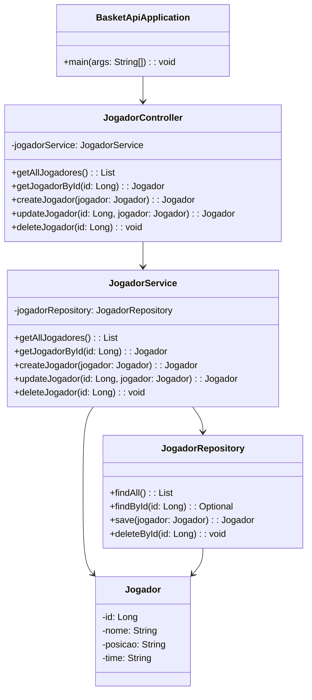

# NBARosterAPI

**NBARosterAPI** é uma API RESTful desenvolvida em **Java** com foco na consulta e gerenciamento de dados de jogadores e times da **NBA**. Ideal para aplicações esportivas, jogos de fantasia ou sistemas de estatísticas, a API permite listar times, jogadores, suas posições, idades e médias de pontos por partida.

## Funcionalidades

- **Consultar Jogadores:** Liste todos os jogadores ou busque por um jogador específico usando seu ID.
- **Cadastrar Jogadores:** Adicione novos jogadores ao sistema.
- **Atualizar Jogadores:** Modifique as informações de um jogador existente.
- **Excluir Jogadores:** Remova um jogador do sistema.
- **Consultar Times:** Possibilidade de consultar os times da NBA e os jogadores pertencentes a eles.

## Arquitetura

A API segue a arquitetura **RESTful** com 3 principais camadas:

- **Controlador (Controller):** Responsável por gerenciar as requisições HTTP e interagir com os serviços.
- **Serviço (Service):** Contém a lógica de negócios, manipulando os dados e se comunicando com o repositório.
- **Repositório (Repository):** Interage com o banco de dados ou com a camada de persistência para realizar operações CRUD.

### Diagrama de Classes


Testando os Endpoints
GET /jogadores - Retorna todos os jogadores.

GET /jogadores/{id} - Retorna um jogador pelo ID.

POST /jogadores - Cria um novo jogador.

PUT /jogadores/{id} - Atualiza as informações de um jogador.

DELETE /jogadores/{id} - Deleta um jogador.

Exemplos de Requisições
Consultar todos os jogadores:

GET /jogadores
Consultar um jogador específico:

GET /jogadores/1
Criar um novo jogador:

POST /jogadores
Content-Type: application/json
```json
{
  "nome": "LeBron James",
  "posicao": "Ala",
  "time": "Los Angeles Lakers"
}
```
Atualizar informações de um jogador:
PUT /jogadores/1
Content-Type: application/json

```json
{
  "nome": "LeBron James",
  "posicao": "Ala",
  "time": "Los Angeles Lakers",
  "idade": 36
}
```
Excluir um jogador:
DELETE /jogadores/1
